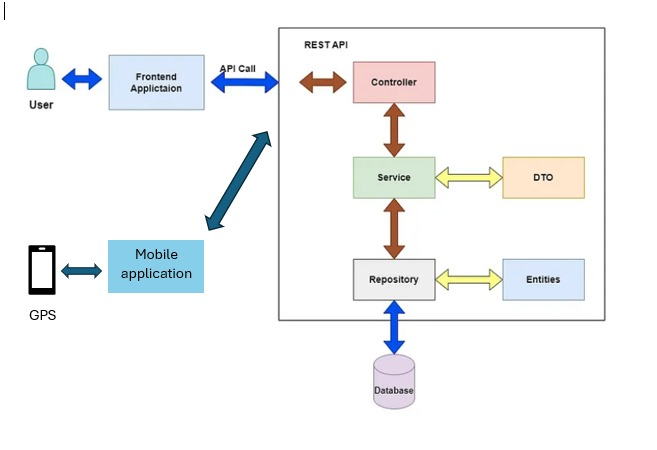

# SmartBendEd_Plateform project


Cet article présente notre plateforme conviviale pour la gestion de flotte de véhicules, visant à améliorer la manière dont les entreprises suivent et organisent leur flotte. Notre objectif est de simplifier la planification, de créer des itinéraires personnalisés et d'augmenter l'efficacité pour les gestionnaires et les conducteurs.

## Table of Contents

- [Overview](#overview)
- [Software architecture](#Software-architecture)
- [Docker Image](#Docker-Image)
- [Frontend](#frontend)
- [Backend](#backend)
- [Getting Started](#getting-started)
- [Dependencies](#dependencies)
- [Video Demonstration](#Video-Demonstration)
- [Contributors](#contributing)

## Overview

Le projet vise à fournir une solution de géolocalisation pour la gestion de flotte de véhicules, répondant aux besoins stratégiques des entreprises dans le domaine de la logistique et du transport.

## Software architecture


L'architecture logicielle suit une approche découplée, utilisant Spring Boot pour l'infrastructure backend avec des contrôleurs dédiés (VehicleController, LocationController, AuthController...) gérant les requêtes HTTP entre le frontend React et la base de données MySQL. Le frontend React se compose de composants tels que Vehicules Liste, Dashboard, Location, etc., facilitant les interactions utilisateur et envoyant des requêtes à Spring Boot.

## Frontend

### Technologies Used

- React/Next.js
- Leaflet/CSS

## Frontend Project Structure

Le projet front-end en React est organisé autour de cinq composants principaux, chacun ayant un objectif spécifique et contribuant à l'architecture globale et à la maintenabilité de l'application.

## 1. Composant ADD

- **Objectif :** Le composant ADD est responsable de l'ajout de nouveaux utilisateurs, véhicules ou données à l'application.
- **Fonctionnalité :** Les utilisateurs peuvent saisir des informations pertinentes et soumettre des données, déclenchant des actions telles que la création de nouveaux enregistrements ou entités.

## 2. Composant GESTION

- **Objectif :** Le composant GESTION se concentre sur la récupération et l'affichage des données provenant du serveur backend.
- **Fonctionnalité :** Il récupère et présente des informations, permettant aux utilisateurs de consulter des détails ou d'effectuer des actions liées aux données récupérées.

## 3. Composant DASHBOARD

- **Objectif :** Le composant DASHBOARD sert de hub central pour les utilisateurs, offrant un aperçu des principales métriques, statistiques ou informations importantes.
- **Fonctionnalité :** Il peut agréger des données provenant de diverses sources et les présenter de manière visuellement attrayante et informative.

## 4. Composant EDIT

- **Objectif :** Le composant EDIT gère la modification des données ou entités existantes.
- **Fonctionnalité :** Les utilisateurs peuvent accéder et modifier des informations, avec des changements reflétés en temps réel ou lors de la soumission.

## 5. Composant HOME

- **Objectif :** Le composant HOME sert de point d'entrée principal de l'application, fournissant une page d'accueil ou une interface initiale.
- **Fonctionnalité :** Il peut inclure des liens de navigation, des messages de bienvenue ou tout autre contenu pour guider les utilisateurs à travers l'application.

## Routage

- **React Router :** Décrivez comment React Router est utilisé pour naviguer entre les différents composants, assurant une expérience utilisateur fluide.

## Style et Thématisation

- **Style :** Spécifiez l'approche de style, que ce soit via CSS simple, SCSS ou l'utilisation d'un framework CSS spécifique.
- **Thématisation :** Si applicable, décrivez comment la thématisation est gérée dans l'application.

## Dépendances

Listez les principales dépendances pour le front-end avec leurs versions.

```
{
  "dependencies": {
    "react": "^17.0.2",
    "react-dom": "^17.0.2",
    "react-router-dom": "^6.0.0"
  },
  "devDependencies": {
    "webpack": "^5.0.0",
    "babel-loader": "^8.0.0"
  }
}
```

## Backend

### Technologies Used

- Spring Boot
- MySQL

## Backend Project Structure

The backend code follows a modular and organized structure, leveraging the power of Spring Boot for building a robust and scalable application.

### 1. `com.example.application`

- **Main Application Class:** `Application.java` sert de point d'entrée pour l'application Spring Boot. Il inclut la méthode `main` pour démarrer l'application.

### 2. `com.example.controller`

- **Controller Classes:** Le package `controller` contient des classes responsables de la gestion des requêtes HTTP entrantes. Chaque classe de contrôleur est dédiée à une fonctionnalité ou entité spécifique, exposant des endpoints RESTful. Ces classes interagissent avec les services pour traiter les requêtes et retourner des réponses appropriées.

### 3. `com.example.service`

- **Service Classes:** Le package `service` héberge des classes qui encapsulent la logique métier. Ces classes sont utilisées par les contrôleurs pour effectuer des opérations sur les données et communiquer avec les repositories. Elles fournissent une couche d'abstraction entre les contrôleurs et les repositories.

### 4. `com.example.model`

- **Entity Classes:** Le package `model` inclut des classes représentant les entités de données de l'application. Ces classes sont annotées avec des annotations JPA, définissant la structure des tables de la base de données. Chaque entité correspond généralement à une table dans la base de données MySQL.

### 5. `com.example.repository`

- **Repository Interfaces:** Le package `repository` contient des interfaces qui étendent les repositories Spring Data JPA. Ces interfaces fournissent des méthodes pour les opérations CRUD de base et sont utilisées par les services pour interagir avec la base de données.

### Dependencies

1. **Spring Data JPA:**

   - **Purpose:** Simplifie l'accès aux données en utilisant JPA dans Spring Boot.

2. **Lombok (Optional):**

   - **Purpose:** Réduit le code boilerplate en générant des méthodes lors de la compilation.

3. **MySQL Connector/J:**
   - **Purpose:** Pilote JDBC pour se connecter à une base de données MySQL.

## Getting Started

Voici des instructions étape par étape pour configurer et exécuter votre projet localement :

### Prerequisites:

1. **Git:**

   - Make sure you have Git installed. If not, download and install it from [git-scm.com](https://git-scm.com/).

2. **Node Version Manager (NVM):**
   - Install NVM from [github.com/nvm-sh/nvm](https://github.com/nvm-sh/nvm).
   - Use NVM to install Node.js version 14.11.0: `nvm install 14.11.0`.

### Backend Setup:

1. **Clone the Project:**

   ```bash
   git clone <repository_url>
   cd <project_folder>
   ```

2. **Install Backend Dependencies:**

   - Open a terminal in the backend project folder.
   - Run the following commands:
     ```bash
     mvn clean install
     ```

3. **Run Backend:**
   - Start your XAMPP Apache and MySQL servers.
   - Run the Spring Boot application. The database and entities will be created automatically.
   - Verify that the backend is running by visiting [http://localhost:8081](http://localhost:8081) in your browser.

### Configuration du Frontend :

1. **Installer Node.js et React :**

   - Ouvrez un nouveau terminal pour le projet frontend.
   - Assurez-vous que NVM utilise la version 14.11.0 de Node.js : `nvm use 14.11.0`.
   - Installez Next.js et React globalement :
     ```bash
     npm install -g next react react-dom
     ```

2. **Installer les Dépendances Frontend :**

   - Exécutez les commandes suivantes dans le dossier du projet frontend :

     ```bash
     npm install
     ```

   - Si vous rencontrez des erreurs lors de l'installation, utilisez la commande suivante :
     ```bash
     npm install --save --legacy-peer-deps
     ```

3. **Exécuter le Frontend :**

   - Après avoir installé les dépendances, démarrez le serveur de développement Next.js :

     ```bash
     npm run dev
     ```

   - Accédez au frontend à l'adresse [http://localhost:3000](http://localhost:3000) dans votre navigateur.

Maintenant, votre projet full-stack devrait être opérationnel localement. En cas de problèmes, vérifiez les journaux de la console pour les messages d'erreur et assurez-vous que toutes les dépendances et les prérequis sont correctement installés.

# Illustrative example

Nous visons à présenter une solution de planification basée sur les préférences et les contraintes de localisation de la flotte de véhicules,répondant aux besoins stratégiques des entreprises dans le domaine de la logistique et du transport.


Figure 2: Interface (Localisation)

Cet interface c'est ou on peut visualiser les vehicules avec leur Matricule,type et leur etat(actif,en panne,en reparation)


Figure 3: Interface trajet

Dans cet interface on peut visualiser le trajet d'un vehicule specifique en precisant le matricule et la date

# Video Demonstration

Click the link below to watch a demonstration video:

## Contributors

- Oussama Benrkia ([GitHub](https://github.com/Oussama-benrkia))
- Malak Elkiram ([GitHub](https://github.com/723malak))
- Haytam Aatita ([GitHub](https://github.com/niperia))
- Ilyes Hamdaoui([GitHub](https://github.com/ilyassoh))
- Elkasri Omaima ([GitHub](https://github.com/Omaimaelk))
- Mohamed Lachgar ([Researchgate](https://www.researchgate.net/profile/Mohamed-Lachgar))
